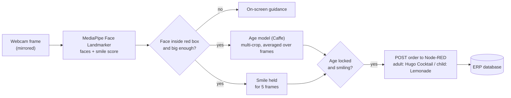

# ERP Lab Kiosk - Smile & Age Based Drink Ordering

> A camera kiosk that estimates a customer's age group, waits for a smile, and places a drink order in the ERP system - no touchscreen, no buttons.


<!--
Add 2-3 screenshots of the running kiosk here, e.g.:


-->

## Table of contents

- [Overview](#overview)
- [Features](#features)
- [How it works](#how-it-works)
- [Quick start](#quick-start)
- [Usage](#usage)
- [Configuration](#configuration)
- [Node-RED integration](#node-red-integration)
- [Project structure](#project-structure)
- [Troubleshooting](#troubleshooting)
- [Limitations](#limitations)
- [Privacy and responsible use](#privacy-and-responsible-use)
- [Roadmap](#roadmap)
- [Credits and third-party components](#credits-and-third-party-components)
- [License](#license)

## Overview

The ERP Lab Kiosk is a small Python application that turns a webcam into a self-service ordering point for the ERP Lab bar:

1. A customer steps in front of the camera and stands inside a **red guide box**.
2. The kiosk **estimates the customer's age group** from the face.
3. When the customer **smiles**, the kiosk places an order:
   - adult: **Hugo Cocktail**
   - minor: **Lemonade**
4. The order is sent as JSON to a **Node-RED** flow, which writes it to the ERP database.

Everything runs locally on the kiosk PC. No images are stored or sent anywhere.

## Features

- **Hands-free ordering** - a smile confirms the order; no touch input required.
- **Robust face and smile detection** using the MediaPipe Face Landmarker (works with glasses, slight head turns and varying light).
- **Stable age estimation** - several crops per frame, averaged over multiple frames, decided by probability instead of a single guess.
- **Safe defaults** - if the age model is unsure, the kiosk falls back to the non-alcoholic drink; very dark faces are never classified.
- **Multi-person handling** - only a face inside the red box is considered; people standing outside are ignored, and two people in the box pause the kiosk.
- **Clear on-screen guidance** - the customer always sees what to do next ("Come a little closer", "Smile to confirm your order", ...).
- **ERP integration** via a simple HTTP POST (Node-RED), with an immediate retry if the ERP is unreachable.
- **Graceful fallback** - if MediaPipe is unavailable, the kiosk runs with classic OpenCV Haar cascades and prints a clear warning.

## How it works



| Step | What happens |
|------|--------------|
| 1. Capture | A frame is read from the webcam and mirrored (selfie view). |
| 2. Detect | MediaPipe returns up to 4 faces with 478 landmarks and expression scores. The **smile score** is the average of `mouthSmileLeft` and `mouthSmileRight`. |
| 3. Select | Only faces whose centre is **inside the red box** count (the box covers the centre 50% x 60% of the frame). The face must cover at least 9% of the frame. If two similar-sized faces are inside the box, the kiosk pauses. |
| 4. Estimate age | The face is cropped at two scales, mirrored, and passed as one batch to the Levi & Hassner age network. The 8 age-bucket probabilities are averaged, then averaged again over the last 8 predictions. |
| 5. Decide | **P(adult) >= 0.60** -> adult, **<= 0.40** -> child. In between, the kiosk keeps analysing; after 8 seconds it picks the safe choice (child). |
| 6. Confirm | The smile (smoothed over 5 frames) must be held for 5 consecutive frames while the age is locked. |
| 7. Order | `{"name": "adult \| Hugo Cocktail"}` is POSTed to Node-RED. A 30 second cooldown follows. |

**Age groups.** The model predicts one of eight buckets: `(0-2)`, `(4-6)`, `(8-12)`, `(15-20)`, `(25-32)`, `(38-43)`, `(48-53)`, `(60-100)`. The first four count as **child**, the rest as **adult**.

## Quick start

### Prerequisites

| Requirement | Details |
|-------------|---------|
| Python | 3.9 - 3.12 (MediaPipe may not yet support the very newest Python versions) |
| Webcam | Any USB or built-in camera |
| Internet | Only once, to download a 3.7 MB model file on first start |
| Node-RED | Running on `localhost:1880` to receive orders (optional for trying out the camera part, see [below](#try-it-without-node-red)) |

Tested with Python 3.12, OpenCV 4.13 and MediaPipe 0.10.33. Windows is the kiosk target platform; the core pipeline also runs on Linux.

### 1. Get the code

```bash
git clone https://github.com/fahadrafiq94/Age_Detection_Odoo_Sales_Workflow.git
```

Or download the project as a ZIP and extract it.

### 2. Create a virtual environment and install dependencies

**Windows (PowerShell)**

```powershell
python -m venv .venv
.venv\Scripts\Activate.ps1
pip install -r requirements.txt
```

**Linux / macOS**

```bash
python3 -m venv .venv
source .venv/bin/activate
pip install -r requirements.txt
```

> **Using Anaconda or Visual Studio Code?** Skip the virtual environment, select your Python interpreter in VS Code (`Ctrl+Shift+P` -> *Python: Select Interpreter*), and run `pip install -r requirements.txt` in that same interpreter's terminal.

### 3. Check the model files

The project folder must contain the age model next to the script:

```
age_deploy.prototxt
age_net.caffemodel
```

The MediaPipe model `face_landmarker.task` is **downloaded automatically on the first start**. If the kiosk PC has no internet, download it on another computer and save it in the project folder as `face_landmarker.task`:

```
https://storage.googleapis.com/mediapipe-models/face_landmarker/face_landmarker/float16/1/face_landmarker.task
```

### 4. Start Node-RED (for real orders)

Start Node-RED so that the order endpoint `http://localhost:1880/wserpbar` is reachable. See [Node-RED integration](#node-red-integration).

### 5. Run the kiosk

```bash
python Kiosk_ERP_Code.py
```

Or open `Kiosk_ERP_Code.py` in Visual Studio Code and choose **Run Python File**.

### 6. Verify the start-up

The console should show:

```
Age model loaded.
Face/smile detector: MediaPipe
Starting ERP Lab Kiosk (press 'q' to quit, 'r' to reset).
```

If you see `Haar (fallback)` and a large `WARNING`, MediaPipe or its model file is missing - see [Troubleshooting](#troubleshooting).

### 7. Place a test order

Stand inside the red box, wait for "Smile to confirm your order", and smile. A successful order prints:

```
Suggestion locked: {'drink': 'Hugo Cocktail', 'age_bucket': '(25-32)', 'age_class': 'adult', ...}
Order initiated for ERP submission...
ERP API response: {"database":"erpbar","customer_id":10,"product_id":8}
ERP send status: True
Order completed. Ready for next customer.
```

### Try it without Node-RED

To test only the camera and detection part, save this as `mock_erp.py` and run it in a second terminal **before** starting the kiosk. It accepts orders and prints them:

```python
from http.server import BaseHTTPRequestHandler, HTTPServer

class Handler(BaseHTTPRequestHandler):
    def do_POST(self):
        body = self.rfile.read(int(self.headers.get("Content-Length", 0)))
        print("Order received:", body.decode())
        self.send_response(200)
        self.send_header("Content-Type", "application/json")
        self.end_headers()
        self.wfile.write(b'{"status":"ok"}')

    def log_message(self, *args):      # keep the console clean
        pass

print("Mock ERP listening on http://localhost:1880/wserpbar  (Ctrl+C to stop)")
HTTPServer(("127.0.0.1", 1880), Handler).serve_forever()
```

## Usage

### Customer flow

1. Step in front of the camera and stand **inside the red box**.
2. Wait a moment while the age is analysed ("Analysing... please hold still").
3. **Smile** and hold it briefly.
4. The screen shows **ORDER SUCCESSFUL** with the suggested drink. The next order is possible after 30 seconds.

### On-screen messages

| Message | Meaning |
|---------|---------|
| Stand inside the RED box and smile | No face visible. |
| Please step into the RED box | A face is visible but outside the box. |
| One person at a time, please | Two similar-sized people are inside the box. |
| Come a little closer | The face is too small or too far away. |
| Too dark - please step into the light | The face is too dark to judge the age. |
| Analysing... please hold still | The age is being estimated (about 1-2 seconds). |
| Smile to confirm your order | Age is known; waiting for a smile. |
| Smile to order (remove mask/sunglasses) | No smile seen for 6 seconds. |
| Great! Hold your smile... | A smile was detected; the order is about to be sent. |
| Next order possible in Ns | Cooldown after an order. |

The age label above the face shows the estimated group and class, e.g. `Age: (25-32) (adult)`. A trailing `?` means the model stayed unsure and the safe choice (child) was used.

### Keyboard controls

| Key | Action |
|-----|--------|
| `q` | Quit the kiosk |
| `r` | Reset the current customer |

A small debug panel in the top-left corner shows *In box*, *Face size*, *Age locked* (with P(adult)), the smoothed *Smile* score, and the active detector.

## Configuration

All settings are constants at the top of [`Kiosk_ERP_Code.py`](Kiosk_ERP_Code.py).

| Setting | Default | Effect |
|---------|---------|--------|
| `CAMERA_INDEX` | `0` | Which camera to use. Try `1` or `2` for an external webcam. |
| `SMILE_THRESHOLD` | `0.40` | Smile score (0-1) needed. Lower = more sensitive, higher = stricter. |
| `SMILE_SMOOTHING_FRAMES` | `5` | Frames averaged for the smile score (reduces flicker). |
| `SMILING_FRAMES_REQUIRED` | `5` | Consecutive smiling frames needed to place an order. |
| `ADULT_PROB_MIN` | `0.60` | Minimum P(adult) to count as adult. Raise to be stricter with adults. |
| `CHILD_PROB_MAX` | `0.40` | Maximum P(adult) to count as child. |
| `UNCERTAIN_TIMEOUT_SEC` | `8` | Seconds until the safe choice (child) is used when the model is unsure. `0` = keep analysing forever. |
| `AGE_WINDOW` | `8` | Number of recent age predictions that are averaged. |
| `AGE_MIN_SAMPLES` | `5` | Predictions required before the age can be locked. |
| `AGE_INFER_EVERY_N_FRAMES` | `3` | Run the age model every N frames. Raise on a slow PC. |
| `AGE_CROP_SCALES` | `(1.1, 1.3)` | Face crops fed to the age model (relative to the face box). |
| `AGE_USE_MIRROR` | `True` | Also feed mirrored crops (more stable, slightly slower). |
| `MIN_FACE_AREA_FRAC` | `0.090` | Required face size as a fraction of the frame. Lower = customer may stand farther away. |
| `MIN_ROI_PIX` | `40` | Minimum face width and height in pixels. |
| `MAX_FACES` | `4` | Maximum number of faces tracked per frame. |
| `BLOCK_MULTIPLE_PEOPLE` | `True` | Pause when two similar-sized people are inside the box. |
| `SECOND_FACE_RATIO` | `0.5` | A second face counts as "similar size" at this fraction of the largest face. |
| `MIN_FACE_BRIGHTNESS` | `30` | Average face brightness (0-255) below which the kiosk says "too dark". |
| `TRIGGER_COOLDOWN_SEC` | `30` | Seconds between two orders. |
| `FACE_LOST_GRACE_SEC` | `0.7` | A short detection drop-out within this time does not reset the customer. |
| `HINT_AFTER_SEC` | `6` | Show the "remove mask/sunglasses" hint after this long without a smile. |
| `DRINK_ADULT` / `DRINK_CHILD` | `"Hugo Cocktail"` / `"Lemonade"` | Drink names sent to the ERP. |
| `ERP_API_POST_URL` | `http://localhost:1880/wserpbar` | Order endpoint. |

## Node-RED integration

The kiosk sends one HTTP request per order:

```
POST http://localhost:1880/wserpbar
Content-Type: application/json

{"name": "adult | Hugo Cocktail"}
```

- `name` has the format `<age_class> | <drink>`, where `age_class` is `adult` or `child`.
- The kiosk treats **HTTP 200** as success and anything else (or no connection) as failure. After a failure it shows **ORDER FAILED** and allows an immediate retry.
- Example response seen in the lab setup: `{"database":"erpbar","customer_id":10,"product_id":8}`.

The Node-RED flow itself (an `http in` node on `POST /wserpbar` that writes the order to the ERP database) is not part of this repository. Exporting it to a `docs/` folder is recommended so the whole setup can be reproduced.

## Project structure

```
AgeDetection/
|-- Kiosk_ERP_Code.py          # main application (run this)
|-- requirements.txt           # Python dependencies
|-- age_deploy.prototxt        # age network definition (Caffe)
|-- age_net.caffemodel         # age network weights (Caffe, ~45 MB)
|-- face_landmarker.task       # MediaPipe model, downloaded automatically on first run
|-- cam test.py                # quick camera check
|-- import cv2.py              # FPS measurement helper
`-- README.md
```

Older prototypes (`ERP_kiosk_code.py`, `kiosk_code.py.txt`, the notebook) and the test screenshots can be kept in a `legacy/` or `docs/` folder.

`Kiosk_ERP_Code.py` is organised in clear sections: configuration, face detectors (MediaPipe and the Haar fallback), age estimation, ERP client, drawing helpers, the `Kiosk` class (one `process(frame)` call per camera frame) and `run_kiosk()` as the entry point.

## Troubleshooting

| Problem | Cause and fix |
|---------|---------------|
| Console prints `Haar (fallback)` and a WARNING | MediaPipe is not installed, does not support your Python version, or `face_landmarker.task` is missing. Run `pip install -r requirements.txt` (Python 3.9-3.12) and make sure the model file is next to the script. |
| `pip install mediapipe` fails | Usually a Python version mismatch. Use Python 3.9-3.12. |
| "Could not download the MediaPipe model" | No internet or a proxy blocks the download. Download the file manually (link in [Quick start](#3-check-the-model-files)) and save it as `face_landmarker.task` in the project folder. |
| `Cannot open camera.` | Another program is using the camera, or the index is wrong. Close other apps and try `CAMERA_INDEX = 1`. Check the operating system's camera privacy settings. |
| `Error loading age model` | `age_deploy.prototxt` or `age_net.caffemodel` is missing or in a different folder than the script. |
| `ORDER FAILED` / `ERP send status: False` | Node-RED is not running or the URL is wrong. Check `ERP_API_POST_URL`, or use the [mock server](#try-it-without-node-red). |
| Smile is not detected | Face the camera, lower `SMILE_THRESHOLD` (e.g. `0.30`), and make sure the face is well lit. Watch the *Smile* value in the debug panel. |
| Smile triggers too easily | Raise `SMILE_THRESHOLD` (e.g. `0.50`) or `SMILING_FRAMES_REQUIRED`. |
| Stuck on "Come a little closer" | Stand closer, or lower `MIN_FACE_AREA_FRAC`. |
| Stuck on "Analysing..." | The age model is unsure (often because of poor lighting or glasses). After `UNCERTAIN_TIMEOUT_SEC` the safe choice is used. Improve the lighting, or adjust `ADULT_PROB_MIN` / `CHILD_PROB_MAX`. |
| Video is choppy on a slow PC | Raise `AGE_INFER_EVERY_N_FRAMES` (e.g. `5`), set `AGE_USE_MIRROR = False`, or use a single entry in `AGE_CROP_SCALES`. |
| `Activate.ps1 cannot be loaded` (PowerShell) | Run `Set-ExecutionPolicy -Scope Process -ExecutionPolicy Bypass` in that window, then activate again. |

## Limitations

- **The age estimate is not a legal age check.** The model is a research-grade classifier with coarse age groups; the `(15-20)` group contains people who are already 18 or older. Glasses, beards, hair, lighting and head pose can shift the result.
- **Face masks:** the face is found, but the age model cannot judge a half-covered face and a smile cannot be seen. The customer has to remove the mask (the kiosk shows a hint after 6 seconds).
- **Lighting matters.** Very dark or strongly backlit faces are not classified. Light the customer from the front.
- **One customer at a time.** The kiosk is designed for a single person in the box.
- **Single camera, frontal view.** The customer should face the camera.

## Privacy and responsible use

- Video frames are processed **in memory only**. No images or video are saved or transmitted.
- The only data sent to the ERP is the order text, for example `adult | Hugo Cocktail`.
- The only other network access is the one-time download of the MediaPipe model.
- Age-estimation models can be less accurate for some groups of people and in some conditions. Do not use this kiosk as the **only** control for age-restricted sales, and inform visitors that a camera is in use.

## Roadmap

Ideas for future improvements:

- Evaluate a more robust or more recent age-estimation model, ideally tested on a larger and more diverse set of faces.
- Detect face masks explicitly and guide the customer immediately.
- Fullscreen kiosk mode and a larger, multilingual user interface.
- Optional logging of anonymous statistics (orders per drink), without any images.
- Export the Node-RED flow and add automated tests for the decision logic.

## Credits and third-party components

- **[OpenCV](https://opencv.org/)** - camera capture, image processing and the deep-learning (DNN) runtime for the age model.
- **[MediaPipe](https://ai.google.dev/edge/mediapipe/solutions/vision/face_landmarker)** (Google) - Face Landmarker with facial expression scores.
- **Age model** - the pre-trained Caffe network and its eight age groups follow *G. Levi and T. Hassner, "Age and Gender Classification Using Convolutional Neural Networks", IEEE Workshop on Analysis and Modeling of Faces and Gestures (AMFG) at CVPR 2015* (trained on the Adience benchmark). Check the licence terms of the model files before any commercial use.
- **[Node-RED](https://nodered.org/)** - receives the orders and connects to the ERP system.

## License

No license has been specified yet. Add a `LICENSE` file before publishing or sharing this repository, and respect the licences of the third-party components listed above.
